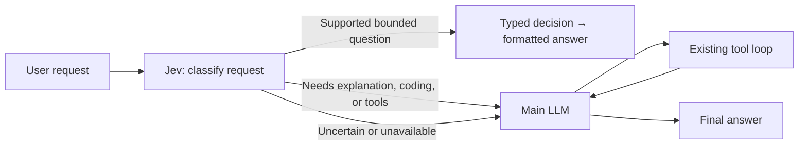

# Jev Mode: request routing and direct answers

Jev Mode puts TypeSafe AI's decision model in front of Albatross's main LLM.
A supported bounded question can receive a fixed, formatted answer without a
main-model call. Everything else follows the existing LLM/tool loop.

This is experimental and off by default.

## Design



One TypeSafe request contains three independent Choice questions: route,
retryability, and error category. Jev evaluates all three against the current
request; code uses only the answer for the selected route. The route and selected
answer must each pass **both** the confidence and selected-option probability
thresholds. An `uncertain` answer always falls back. The formatter is ordinary
Rust code; Jev does not generate prose.

## Supported direct questions

This first version supports self-contained English questions with the error text
included in the current request:

| Question | Bounded decisions | Example |
| --- | --- | --- |
| Error category | authentication, permission, rate limit, network, invalid input, server, uncertain | `Categorize this error: HTTP 429 Too Many Requests.` |
| Retryability | transient, persistent, uncertain | `Does this error look transient or persistent? HTTP 503 Service Unavailable.` |

A confident rate-limit classification becomes `Error category: rate limit / quota.`
A transient classification says a later attempt may succeed and explicitly does
not establish that repeating the operation is safe. Jev never retries anything.

Requests for explanations, edits, commands, tests, multiple tasks, other formats or
languages, and questions requiring earlier conversation or missing files are
instructed to route to the main LLM. Short prompts and yes/no wording alone are not
sufficient for direct answering. For example, `Fix this 429 error` and `Explain
why this request failed` belong on the main-model path.

This semantic boundary depends on Jev's judgment and can be misclassified, even
at high confidence. Multipart prompts and text over 16 KiB deterministically
bypass Jev. Text is never silently truncated to obtain a direct answer.

## Enable

Set `TYPESAFE_API_KEY` in the environment before launching Albatross. Then use:

```text
/jev shadow
/jev on
/jev off
/jev status
```

These settings last for the current session. `on` is an alias for `active`.
For persistent project configuration, add this to `agent.config.json`:

```json
{
  "jev": {
    "mode": "shadow",
    "model": "jev-1.13.0",
    "timeoutMs": 1500,
    "minConfidence": 0.9,
    "minProbability": 0.95
  }
}
```

- **off:** no Jev requests; existing behavior.
- **shadow:** classify and record whether a direct answer would have been possible,
  then always run the normal main-model path.
- **active:** return a direct answer when both decisions pass; otherwise run the
  normal main-model path.

## Execution and fallback

Interactive routing runs after UserPromptSubmit hooks (including any prompt rewrite)
and before main-model warmup or automatic pre-turn compaction. Those calls are
skipped for direct answers. When Jev is configured at startup, initial warmup is
deferred until a request needs the main model. Provider readiness probes may still
run. Enabling Jev later does not undo warmup calls already made.

A direct answer emits a normal text event, appends an assistant message, and returns
a completed turn with zero main-model steps or tokens. Session persistence and
outer turn lifecycle hooks continue normally. The existing LLM tool gate,
approvals, and compaction behavior apply unchanged on fallback.

The interactive CLI, one-shot CLI, agent-eval runner, and Rust SDK support routing.
Nested investigation agents and rubric evaluators do not independently route
through Jev. There is one routing request per eligible user turn, not per tool call.

Missing keys, invalid numeric settings, HTTP failures, timeouts, invalid or missing
answers, and oversized responses all fall back to the main LLM. Cancellation stops
the turn. There are no automatic Jev retries. Requests have a configured timeout
(1–10000 ms), a 48 KiB serialized body cap, and a 64 KiB response cap. Responses are
validated for option membership, complete distributions, finite probabilities,
normalization, and agreement between the selected option and the highest probability.

## Data and accounting

Enabling shadow or active mode opts into sending the current request text to
TypeSafe, even if the main model is local. Prior conversation, system instructions,
repo maps, and tool results are not implicitly sent. Text/code pasted in the request
is included. Known secret patterns are redacted; that is not comprehensive content
sanitization. Credentials come only from the environment. The production endpoint
is fixed to `https://api.typesafe.ai/v1/systemone`; redirects are disabled.

CLI status lines show the selected path, routing latency, and Jev input tokens.
Session `.events.jsonl` files contain `harnessDecision` reports with mode, model,
latency, both token counts, decisions, `direct_answer`, `would_answer`, and fallback
reason. Reports omit the request text and API key. Agent-eval JSON and SDK turn
stats also expose a separate `jev` report.

Existing main-model token and cost counters **exclude Jev**, including on fallback.
Direct answers do not produce a main-model call receipt. At the researched TypeSafe
price, estimated Jev cost is `sum(jev.input_tokens) * 0.042 / 1_000_000` USD; this is
an estimate rather than provider-reported billing. Add it to main-model cost when
comparing modes. No performance or cost improvement has been established live.

## Rust SDK

```rust,no_run
use albatross_cli::sdk::{AgentBuilder, JevConfig, JevMode};

# async fn example() -> anyhow::Result<()> {
let mut session = AgentBuilder::new()
    .jev(JevConfig { mode: JevMode::Active, ..Default::default() })
    .build()?;
let result = session.prompt("Categorize this error: HTTP 429 Too Many Requests.").await?;
println!("{}", result.response);
if let Some(report) = result.stats.jev {
    println!("{}", report.status_line());
}
# Ok(())
# }
```

## Research and validation

Primary sources checked September 20, 2026:

- [TypeSafe launch and methodology](https://typesafe.ai/blog/introducing-system-one-models-and-jev)
- [HTTP API contract](https://docs.typesafe.ai/api)
- [Confidence versus probability](https://docs.typesafe.ai/confidence)
- [Model IDs, limits, pricing](https://docs.typesafe.ai/models)
- [Jev 1.13 limitations](https://docs.typesafe.ai/model-jaggedness/jev-1.13)

TypeSafe describes Jev as a decision model, with structured outputs rather than
free-form generation. Its advertised latency and cost are vendor measurements.
Schema correctness does not establish semantic correctness. Published limitations
include adversarial state, irrelevant detail, arithmetic, and multi-step reasoning.

Offline tests use a local mock of the HTTP contract. They verify zero main-model
calls on a direct answer, fixed formatting, separate usage, shadow behavior,
confidence fallback, unchanged tool permissions, cancellation, and malformed/error
responses. They do not measure Jev classification accuracy.

Before relying on active mode, compare identical prompts with a fixed main model
and effort in off, shadow, and active modes. Include supported questions, compound
requests, missing context, adversarial quoted errors, and normal engineering tasks.
Measure task/answer correctness first; then direct-answer coverage, false direct
answers, main-model tokens, Jev tokens, combined cost, and end-to-end latency.
Requests routed to the LLM incur an extra routing call: avoided model calls must
outweigh this overhead to produce a benefit.
